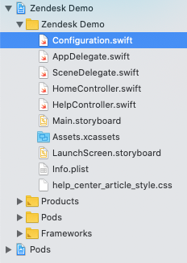
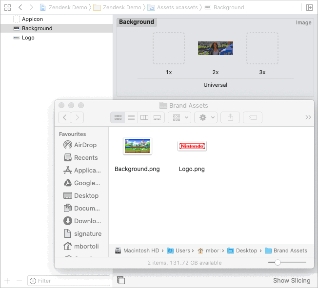

# Zendesk iOS Sample Mobile App

This project is intended to show how the Zendesk SDKs are integrated to an iOS app, and allow you to create a branded and customized iOS simple sample app using all of them (Support, Chat, AnswerBot).

## REQUIREMENTS

- Xcode 11.4.X
- CocoaPods

## HOW TO USE

Download this project, uncompress it and follow the steps below.

### GETTING STARTED
- Make sure you have Xcode and CocoaPods installed on your computer
- If you don't have Xcode installed, you can find it for free in your App Store
- If you don't have CocoaPods, install it by running the following command on Terminal:
  ```console
  sudo gem install cocoapods
  ```

### CONFIGURATION
- Open the `Zendesk Demo.xcworkspace` file using Xcode
- On the left-side panel of Xcode, open the `Configuration.swift` file and change the following information.



#### FOR THE HOME SCREEN
```swift
// Configuration.swift

// Set your customer's website below
static var url = "https://www.zendesk.com"

// If you want to inject some extra customization (JavaScript) on your customer's website, add it below.
// If you don't want to inject any custom code, just leave the "script" var unchanged.
//
// PS: this is a local customization. It might be useful for demo purposes only.
static var script = """
                    // Custom code starts here

                    /* YOUR JAVASCRIPT CODE GOES HERE */

                    // Custom code ends here
                    """
```

FYI: If you don't want to inject any extra JavaScript code on the customer's website, just leave the `script` var unchanged. This is useful when you want to inject some extra information locally. For example, if you want to add a Zendesk Web Widget to their website, you would want to change it to:
```swift
static var script = """
                    // Custom code starts here

                    window.addEventListener('load', function() {
                      var url = 'https://static.zdassets.com/ekr/snippet.js?key=3798e302-522f-45c9-9ac6-20c7b0e62753';

                      var script = document.createElement('script');
                      script.type = 'text/javascript';
                      script.id = 'ze-snippet';
                      script.src = url;

                      document.getElementsByTagName('head')[0].appendChild(script);
                    });

                    // Custom code ends here
                    """
```

#### FOR THE HELP SCREEN

```swift
// Configuration.swift

// Mobile SDK App ID
// You can find this information at https://{subdomain}.zendesk.com/agent/admin/mobile_sdk
static var appId = "2d8e09ff8fbc16f0872134115930297d1cb2e7a4080f514f"

// Mobile SDK Client ID
// You can find this information at https://{subdomain}.zendesk.com/agent/admin/mobile_sdk
static var clientId = "mobile_sdk_client_b6843f88bc1fc23caf47"

// Zendesk URL
// URL of your instance following the format https://{subdomain}.zendesk.com
// PS: Do not include any additional path other than the main URL of your help center (do not add "/hc/en-us/...")
static var zendeskUrl = "https://madisonisland.zendesk.com"

// Fake Identity Name (anonymous authentication)
static var identityName = "John Doe"

// Fake Identity Email (anonymous authentication)
static var identityEmail = "johndoe@z3ntest.com"

// Zendesk Chat Account Key
// You can find this information at https://{subdomain}.zendesk.com/chat/agent
// Click on the avatar icon on the top-right side of the screen and select "Check connection"
static var chatKey = "uDwUGy6SFx9fJEs3iIAsS1kozRa7u0GR"
```

#### CUSTOMIZING THE BRANDING
- Open the `Assets.xcassets` folder on the left-side panel of your Xcode project
- Click on "Background" and drag-and-drop a new background into the old 2x image
- Repeat the same process for the logo


FYI: For better results, use high-resolution images for both background and the logo. A PNG with a transparent background is also recommended for the logo. If you notice unwanted crop on the images or the logo being smaller than it should be, please use an image editor to make sure that your image doesn't have unwanted extra blank space on its surroundings.

### EXTRA OPTIONAL CUSTOMIZATION
If you want to [customize the look](https://developer.zendesk.com/embeddables/docs/ios_support_sdk/customize_the_look) of your help center, you can edit the file `help_center_article_styles.css`.

## IMPORTANT
Do not change any other file other than `Configuration.swift`, `help_center_article_styles.css`, or assets, unless you know what you're doing.

## CUSTOMIZATION DEMO
[](https://www.youtube.com/watch?v=mqjJ3LxLHY8)

## CHANGELOG

### 2020-06-16
- SDKs updated

### 2020-05-29
- Allow websites with mixed content (http/https) to be used in the Home screen

### 2020-05-19
- Zendesk SDKs updated to their latest version
- Added Chat to the "I need help" button (AnswerBot + Support + Chat)
- Added ability to attach files/request camera access (available if using an actual phone)
- Fixed "Call Us" button to avoid opening the help center screen
  PS: the "Call Us" button is not related to any Zendesk SDK and will only work in an actual phone (not on Simulator)
- Various small changes

### 2020-04-03
Introduced Unified SDK + SDK updates (kudos to Carl Goldberg)

### 2020-01-15
First version released
